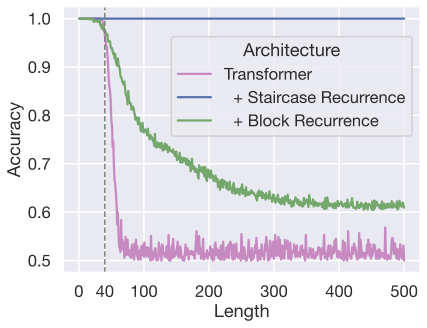

# Recurrent Transformers Trade-off Parallelism for Length Generalization on Regular Languages

**Paul Soulos, Aleksandar Terzić, Michael Hersche, Abbas Rahimi**

_The First Workshop on System-2 Reasoning at Scale, NeurIPS'24_

<div align="center">
  
</div>

## [[Paper]](https://openreview.net/forum?id=6PjZA4Jvge)

## Installation instructions
1. Create a conda environment with python==3.10
*  `conda create -n chomsky python=3.10`
2. Install pytorch == 2.3.1 for your system depending on CPU or GPU
3. Clone the repo
4. Change the name of the repo directory
* `mv recurrent-chunked-models-regular-languages recurrent_chunked_models_regular_languages`
5. Install the requirements `pip install -r requirements.txt`
* Note: the package block-recurrent-transformer-pytorch requires you install on a machine with a GPU. If you are installing on a machine with CPU only, comment out that line.
6. Put the directory on your python path
* `export PYTHONPATH=$(pwd)/..`
7. Try launching a run:
* `python experiments/example.py --task parity_check --wandb_project PROJECT --architecture my_staircase --is_causal 1 --include_eos 0 --validate --batch_size=2 --dropout=0.1 --embed_size=64 --fix_staircase_size_forward=2 --group_size=2 --num_heads=8 --num_recurrent_calls=2 --second_training_steps=20000 --wd=0.01`
7. If you want to use wandb:
from the command line, run `wandb login`
When launching `python experiments/example.py`, use the flag `--use_wandb`

## Running hyperparameter search
1. `wandb sweep --project <project-name> <path-to-config file>`. For example, `wandb sweep --project PROJ ./sweeps/staircase/parity_check/chunk_2_search.yaml` would create a sweep in a project PROJ for staircase attention with a chunk size of 2. When you run this command, wandb will return a sweep_id that you pass into the next command
2. `for (( i=1 ; i<=20 ; ++i )) ; wandb agent --count 1 USER/PROJ/sweep_id; done` to launch 20 runs.

## Running random seeds of the best setting
1. `wandb sweep --project <project-name> <path-to-config file>`. For example, `wandb sweep --project PROJ ./sweeps/staircase/parity_check/chunk_2_best.yaml` would create a sweep in a project PROJ for staircase attention with a chunk size of 2. When you run this command, wandb will return a sweep_id that you pass into the next command
2. `for (( i=1 ; i<=5 ; ++i )) ; wandb agent --count 1 USER/PROJ/sweep_id; done` to launch 5 runs.

## Acknowledgements
This repo is heavily inspired by the repo from the [Neural Networks and the Chomsky Hierarchy repo](https://github.com/google-deepmind/neural_networks_chomsky_hierarchy) from DeepMind.

## Citing This Work

```bibtex
@inproceedings{
soulos2024recurrent,
title={Recurrent Transformers Trade-off Parallelism for Length Generalization on Regular Languages},
author={Paul Soulos and Aleksandar Terzic and Michael Hersche and Abbas Rahimi},
booktitle={The First Workshop on System-2 Reasoning at Scale, NeurIPS'24},
year={2024},
url={https://openreview.net/forum?id=6PjZA4Jvge}
}
```


## License
Our code is licensed under Apache 2.0. Please refer to the LICENSE file for the licensing of our code. 